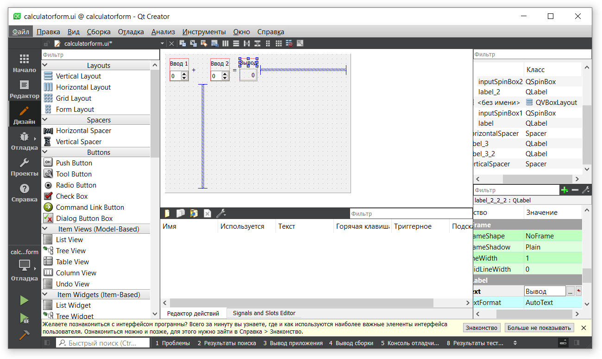

МИНИСТЕРСТВО НАУКИ  И ВЫСШЕГО ОБРАЗОВАНИЯ РОССИЙСКОЙ ФЕДЕРАЦИИ 
Федеральное государственное автономное образовательное учреждение высшего образования 
"КРЫМСКИЙ ФЕДЕРАЛЬНЫЙ УНИВЕРСИТЕТ им. В. И. ВЕРНАДСКОГО" 
ФИЗИКО-ТЕХНИЧЕСКИЙ ИНСТИТУТ 
Кафедра компьютерной инженерии и моделирования

 
<h3 align="center">Отчёт по лабораторной работе № 4  по дисциплине "Программирование"</h3>
  

студента 1 курса группы ПИ-б-о-201(1) 
Баклажков Егор Олегович 
направления подготовки 09.03.04 "Программная инженерия"

  
<table>
<tr><td>Научный руководитель  старший преподаватель кафедры  компьютерной инженерии и моделирования</td>
<td>(оценка)</td>
<td>Чабанов В.В.</td>
</tr>
</table>
  

Симферополь, 2021

## Лабораторная работа №4 Знакомство с фреймворком Qt
**Постановка задачи:**
Настроить рабочее окружение, для разработки программного обеспечения при помощи Qt и IDE Qt Creator, а также изучить базовые возможности данного фреймворка.

**Цель работы:** 
1.  Установить фреймворк Qt;
2.  Изучить основные возможности создания и отладки программ в IDE Qt Creator.

## Ход работы
### Задание 1
Скачаем QT Community с официального сайта. В процессе установки выберем компоненты QT для сборки с помощью MinGW. Проверим успешность скачивания запустив среду разработки QT Creator и в разделе Примеры найдём проект Calculator Form Example. В Редакторе заменим текст "Input 1", "Input 2", "Output" на "Ввод 1", "Ввод 2, "Вывод".

Рис. 1 - Замена текста в редакторе
### Задание 2
1.  Как изменить цветовую схему (оформление) среды?
2.  Как закомментировать/раскомментировать блок кода средствами Qt Creator? Имеется ввиду комбинация клавиш или пункт меню.
3.  Как открыть в проводнике Windows папку с проектом средствами Qt Creator?
4.  Какое расширение файла-проекта используется Qt Creator? Может быть несколько ответов.
5.  Как запустить код без отладки?
6.  Как запустить код в режиме отладки?
7.  Как установить/убрать точку останова (breakpoint)?
### Задание 3
6-я строка: i(int) = 0; d(double) = 9.74653e-318; 
7-я строка: i(int) = 5; d(double) = 9.74653e-318; 
8-я строка: i(int) = 5; d(double) = 5; 
## Вывод:
 Установил фреймворк Qt, изучил основные возможности создания и отладки программ в IDE Qt Creator.